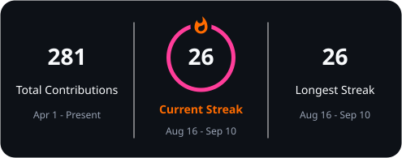

<h1 align="center"> Jhody Atinon</h1>

  BSIT student · aspiring software engineer · PUP Sto. Tomas

Heyya! I’m Juday, a BSIT student from PUP Santo Tomas. Welcome to my GitHub! This space will showcase the projects I’ve worked on during my journey here at PUP. Right now, I’m still exploring different areas of IT and figuring out which path fit my strengths, personality, and style. The tech world is huge and sometimes overwhelming, but I’m taking it step by step, learning as I go. There have been challenges along the way, but each one pushes me to grow and keep moving forward. I’m excited for the milestones ahead and rooting for more achievements in the future. FIGHTING!

## About Me

- Building **MakiKonek Mobile**, an audit system for GCash, and my undergraduate capstone.
- Deepening my full-stack development, database administration, and network administration practice.
- Working with PHP, MySQL, PostgreSQL, C#, Figma, and thoughtful database design.
- Away from the keyboard: strength training and volleyball.

## Activity

  

  
  

## Selected work

- **MakiKonek Mobile**
- **Audit System for GCash**
- **Personal Portfolio**
- **Undergraduate Capstone**

| Project                                               | Focus                                                 |
| ----------------------------------------------------- | ----------------------------------------------------- |
| **MakiKonek Mobile**                                  | A mobile project currently in development.            |
| **GCash Audit System**                                | A system supporting more reliable audit workflows.    |
| [**Personal Portfolio**](https://jhy-atnn.github.io/) | A growing home for my work, process, and experiments. |
| **Undergraduate Capstone**                            | Research and development in progress.                 |

## Portfolio

  

  <a href="https://jhy-atnn.github.io/"><strong>Open my portfolio →</strong></a>

## Tech Stack & Tools

### Languages & Frameworks

  

### Design & 3D

  
  

### Tools

  
  
  

## Connect

  
  
  
  

